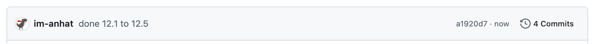
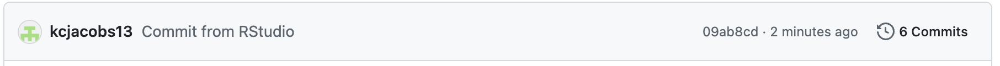

<!-- README.md is generated from README.Rmd. Please edit the README.Rmd file -->


```{r setup, include=FALSE}
knitr::opts_chunk$set(echo = TRUE)
```

# Lab report #1

Follow the instructions posted at https://ds202-at-isu.github.io/labs.html for the lab assignment. The work is meant to be finished during the lab time, but you have time until Monday evening to polish things.

Include your answers in this document (Rmd file). Make sure that it knits properly (into the md file). Upload both the Rmd and the md file to your repository.  

All submissions to the github repo will be automatically uploaded for grading once the due date is passed.
Submit a link to your repository on Canvas (only one submission per team) to signal to the instructors that you are done with your submission.

Nhat Le

12.1 Checked and met all prerequisites

12.2 The repo already exists on github at this point

12.3 cloned online github classroom repo to local computer and was able to edit now!

12.4 'This is a line from RStudio'

12.5 My local changes were pushed to Github successfully (I'll push now)

12.6 

12.7 Skipped this step because of the instructions for the lab

Keenan Jacobs

12.1 All good, have met all requirements

12.2 Everything has been done

12.3 Got everything set up and cloned repository

12.4 'This is a line from RStudio' as well as the rest of these lines/edits

12.5 About to push the Github changes

12.6 

12.7 Skipped


